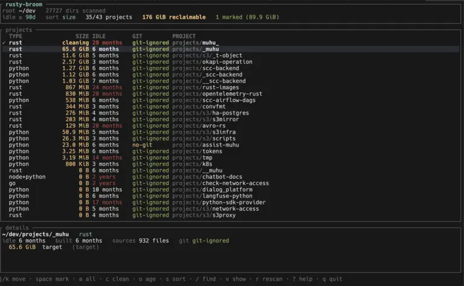

# rusty-broom

[](https://github.com/oriontvv/rusty-broom/actions/workflows/ci.yml) [](https://htmlpreview.github.io/?https://github.com/oriontvv/rusty-broom/coverage/htmlcov/index.html) [](https://deps.rs/repo/github/oriontvv/rusty-broom) [](https://crates.io/crates/rusty-broom)

<p align="center">
  
</p>

Освобождает диск от сборочного мусора в проектах, которыми вы давно не занимались:
`target`, `node_modules`, `.venv`, `build`, `Pods` и так далее.

<p align="center">
  
</p>

Основной критерий — как давно проект трогали. Возраст считается по времени
изменения **собственных файлов проекта**: артефакты, `.git` и служебные каталоги
из подсчёта исключены, поэтому пересборка или `git gc` не делают заброшенный
проект «свежим», а правка исходников или `git pull` — делают.

Удаляются только те пути, которые git сам считает игнорируемыми
(`git check-ignore`). Закоммиченный `dist/` или `vendor/` останется на месте,
даже если он перечислен в конфиге. Проекты вне git-репозитория помечаются как
`no-git`, и их артефакты не проверяются — это видно в отчёте и в интерфейсе.

## Сборка

```sh
cargo build --release
./target/release/rusty-broom --help
```

## CLI

```sh
# посмотреть, что есть под ~/dev (порог по умолчанию — 30 дней)
rusty-broom scan ~/dev

# проекты, которых не касались полгода, с раскладкой по артефактам
rusty-broom scan ~/dev --older-than 6mo --long

# только крупные и только определённых типов, в порядке возраста
rusty-broom scan ~/dev -o 1y -m 500M -t rust -t node --sort age

# машинно-читаемый вывод
rusty-broom scan ~/dev --json | jq '.totals'

# удалить: сначала посмотреть план, потом подтвердить
rusty-broom clean ~/dev -o 1y --dry-run
rusty-broom clean ~/dev -o 1y            # спросит подтверждение
rusty-broom clean ~/dev -o 1y --yes      # без вопросов

# что вообще умеет определять
rusty-broom types
```

Полезные флаги: `--all` (игнорировать порог возраста), `--query TEXT` (фильтр по
пути), `--nested` (показывать и вложенные проекты — членов workspace),
`--max-depth N`, `--no-git-check` (снять проверку git — на свой риск).

`clean` без `--yes` в неинтерактивной среде не удаляет ничего и завершается с
ошибкой: подтверждать нужно явно.

## TUI

```sh
rusty-broom ~/dev          # без подкоманды открывается интерфейс
rusty-broom tui ~/dev -o 90d
```

Проекты появляются в списке сразу, как только найдены; размеры артефактов
считаются в фоне пулом воркеров и подтягиваются по мере готовности (пока
размер не досчитан, он показан как `~4.2 GiB`).

| Клавиша      | Действие                                            |
|--------------|-----------------------------------------------------|
| `j/k`, `↑/↓` | перемещение, `g`/`G`, `PgUp`/`PgDn` — к краям        |
| `space`      | отметить/снять отметку                              |
| `a` / `A`    | отметить всё видимое / снять все отметки            |
| `c`, `Enter` | очистить отмеченные (или текущий) — с подтверждением |
| `o` / `O`    | повысить/понизить порог «не трогали дольше чем»     |
| `s`          | порядок сортировки: size → age → path → type        |
| `/`          | фильтр по пути или типу                             |
| `v`          | показывать и проекты, в которых нечего чистить      |
| `r`          | пересканировать заново                              |
| `?`          | справка по клавишам                                 |
| `q`, `Esc`   | выход                                               |

## Конфигурация

```sh
rusty-broom config init    # создать пользовательский конфиг из встроенного
rusty-broom config path    # какой файл используется
rusty-broom config show    # итоговая конфигурация
```

Порядок поиска: `--config FILE` → `./.rusty-broom.toml` →
`~/.config/rusty-broom/config.toml` (на macOS —
`~/Library/Application Support/rusty-broom/config.toml`) → встроенный конфиг.

Типы проектов описываются так:

```toml
[settings]
older_than = "30d"
max_depth = 8
require_git_ignored = true

[[project_types]]
name = "rust"
markers = ["Cargo.toml"]      # по чему проект опознаётся
artifacts = ["target"]        # что можно удалять

[[project_types]]
name = "python"
markers = ["pyproject.toml", "setup.py", "setup.cfg", "requirements.txt", "Pipfile", "poetry.lock"]
artifacts = [
    "**/__pycache__", ".venv", "venv", ".tox", ".nox",
    ".mypy_cache", ".pytest_cache", ".ruff_cache", ".ipynb_checkpoints",
    "build", "dist", "*.egg-info", "htmlcov",
]
```

`markers` и `artifacts` понимают `*`, `?`, вложенные пути (`app/build.gradle`)
и `**` — любую глубину (`**/__pycache__`). По умолчанию достаточно одного
совпавшего маркера; `require_all_markers = true` требует все (так устроен
тип `unity`). Свой `[[project_types]]` с уже существующим именем заменяет
встроенный, с новым — добавляется; `enabled = false` выключает тип.

Из коробки поддерживаются rust, node, python, maven, gradle, sbt, dotnet, go,
cmake, swift, cocoapods, elixir, dart, php, ruby, haskell, zig, terraform,
unity и latex (последний выключен).

## Как это устроено

- `scan` — обход корней, определение типов, раскрытие шаблонов артефактов и
  датировка проекта.
- `engine` — поток-сканер плюс пул воркеров: сначала фильтрация путей через
  git, затем замер размеров, затем удаление. Всё общение — события в канале,
  поэтому интерфейс не блокируется на вводе-выводе, а CLI просто вычитывает тот
  же поток до конца.
- `clean` — удаление с проверками: цель обязана лежать внутри корня проекта,
  корень не может быть домашним каталогом или лежать в двух шагах от корня ФС,
  символические ссылки удаляются как ссылки и никогда не обходятся.

Размер считается по фактически занятым блокам (`st_blocks`), то есть так же, как
его показывает `du`.

## Разработка

```sh
cargo test
cargo clippy --all-targets
bash scripts/fixture.sh   # разложить тестовые проекты в $TMPDIR для ручной проверки
```
